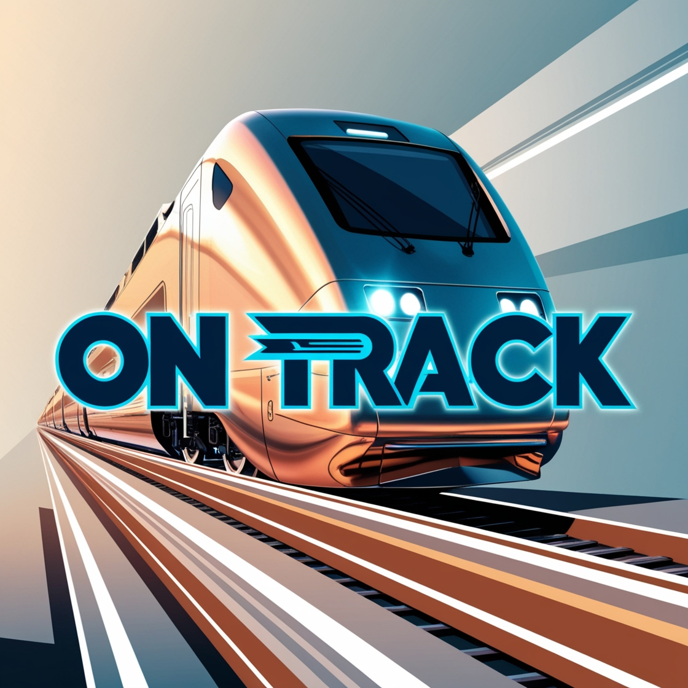

#  OnTrack - Train station management 
## 🚆 Descripción general

OnTrack es una aplicación diseñada para revisores/as de viajes de tren en una 
pequeña estación. A través de una arquitectura de microservicios, la aplicación 
pretende ser una herramienta práctica para revisar la información de los trenes, 
conductores/as y pasajeros/as. Su planificación inicial incluiría el seguimiento semanal de los viajes desde la estación de tren base a diferentes destinos, con un único tren por semana y destino.

## 📑 Arquitectura

OnTrack está compuesta por los siguientes microservicios, registrados en Eureka y que se 
comunican a través de Feign Clients:

| **Servicio**     | **Puerto** | **Descripción**                   |
|------------------|------------|-----------------------------------|
| `Discovery-server` | 8761       | Para registros Eureka             |
| `Gateway-service`  | 8087       | API Gateway, enrutamiento         |
| `Train-service`    | 8080       | Gestión de trenes                 |
| `Driver-service`   | 8082       | Gestión de conductores/as de tren |
| `Traveler-service` | 8081       | Gestión de pasajeros/as           |

## 🏃 Instalación e inicio

### Prerrequisitos: 
+ Java 21
+ Maven 3.6+
+ MySQL 8.0+

1. <ins>Crear bases de datos en MySQL<ins>  

   
   CREATE DATABASE traveler_service;\
   CREATE DATABASE train_service;\
   CREATE DATABASE driver_service;\

2. <ins>Clonar los repositorios<ins>

   `git clone https://github.com/Ironhack-final-project-trainStation/train-service.git` \
   `git clone https://github.com/Ironhack-final-project-trainStation/driver-service.git` \
   `git clone https://github.com/Ironhack-final-project-trainStation/traveler-service.git` \
   `git clone https://github.com/Ironhack-final-project-trainStation/gateway-service.git` \
   `git clone https://github.com/Ironhack-final-project-trainStation/discovery-service.git` 

3. <ins>Configurar **application.properties** en los microservicios **train/traveler/driver**\<ins>

Define el nombre de la aplicación y la URL de Eureka.\
Modifica el usuario y contraseña de MySQL.

4. <ins>Ejecutar los servicios en el siguiente orden:<ins>

+ discovery-server
+ gateway-service
+ train-service
+ driver-service
+ traveler-service

## 🚦 API Gateway y endpoints

El `gateway-service` escucha en el puerto 8087 y enruta las peticiones a los microservicios de la siguiente forma:\
+ `/api/train/**` ➡️ train-service
+ `/api/traveler/**` ➡️ traveler-service
+ `/api/driver/**` ➡️ driver-service

**Train**

`GET /api/train` obtener todos los trenes activos.\
`GET /api/train/{id}/info` obtener la información completa de un tren activo, junto su driver y a los passengers.\
`GET /api/train/{id}` buscar un tren por su id.\
`GET /api/train/destination/{destination}` buscar un tren por su destino.\ 
`POST /api/train` crear nuevo tren.\
`PUT /api/train/{id}` actualiza la información de un tren existente.\
`DELETE /api/train/{id}` borra un tren existente.

**Driver**

`GET /api/driver/{id}` buscar un conductor/a por su id, y acceder a la información de su tren.\
`GET /api/driver/train/{trainId}` busca un conductor/a por el tren que conduce.\
`POST /api/driver` crear nuevo conductor/a.\
`PUT /api/driver/{id}` actualiza la información de un conductor/a existente.\
`DELETE /api/driver/{id}` borra un conductor/a existente.

**Traveler**

`GET /api/traveler/id/{id}` buscar un pasajero/a por su id, y acceder a la información de su tren.\
`GET /api/traveler/train/{trainId}` busca todos los pasajeros/as de un tren.\
`POST /api/traveler` crear nuevo pasajero/a.\
`PUT /api/traveler/{id}` actualiza la información de un pasajero/a existente.\
`DELETE /api/traveler/{id}` borra un pasajero/a existente.

## 💻 Tecnologías

+ Java 21
+ Spring Boot 3.5.0
+ Spring Cloud Eureka / OpenFeign / Gateway
+ Spring Data JPA
+ JUnit 5 / Mockito / MockMvc / RestTemplate (para test unitarios, de integración y end to end)
+ MySQL
+ Lombok
+ Maven

## ✏️ Diagrama UML
**Estructura de clases**

## 🌟 Futuras mejoras

+ Incluir atributos de fecha, y poder gestionar viajes activos o pasados según la fecha que se introduzca.\
+ Complejizar las clases (por ej: poder mostrar cuántas plazas quedan en un tren)\
+ Mejora de respuestas que llaman a feign clients.\

<!--

**Here are some ideas to get you started:**

🙋‍♀️ A short introduction - what is your organization all about?
🌈 Contribution guidelines - how can the community get involved?
👩‍💻 Useful resources - where can the community find your docs? Is there anything else the community should know?
🍿 Fun facts - what does your team eat for breakfast?
🧙 Remember, you can do mighty things with the power of [Markdown](https://docs.github.com/github/writing-on-github/getting-started-with-writing-and-formatting-on-github/basic-writing-and-formatting-syntax)
-->
